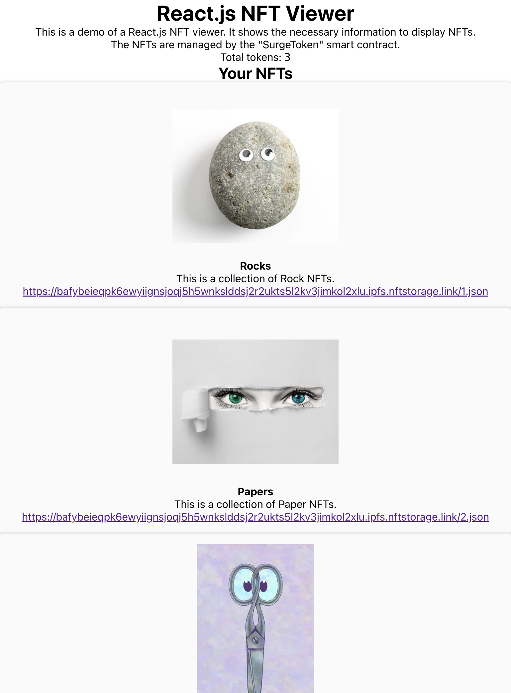

# Setup Wallets

```bash
# https://docs.avax.network/build/tutorials/smart-contracts/using-truffle-with-the-avalanche-c-chain
# Run 5 Avalanche nodes locally
cd ~/go/src/github.com/ava-labs/avalanche-network-runner
go run examples/local/fivenodenetwork/main.go
```

```bash
# Run Truffle console
truffle console --network development
```

# Fund Wallets

```bash
truffle exec fund-cchain-addresses.js --network development
```

# Transfer NFTs from Main Account to another account

```bash
# Inside Truffle console
# Get Token Instance
let token = await SurgeToken.deployed();
# Rock (id: 1, amount: 1)
token.safeTransferFrom(accounts[0], accounts[1], 1, 1, [])
# Paper (id: 2, amount: 1)
token.safeTransferFrom(accounts[0], accounts[1], 2, 1, [])
# Scissors (id: 3, amount: 1)
token.safeTransferFrom(accounts[0], accounts[1], 3, 1, [])
```


